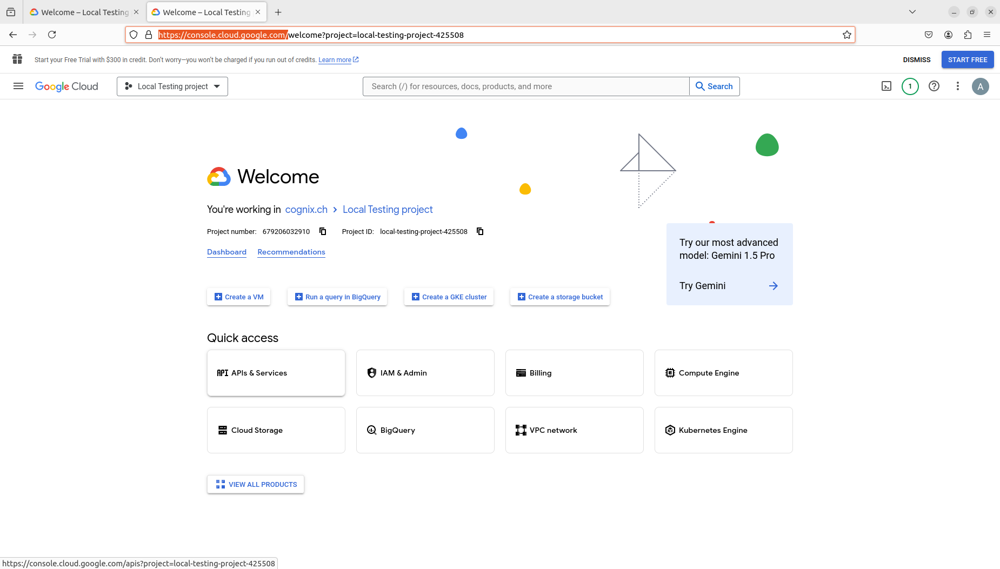

### Google Drive 

1. Open your web browser and navigate to the [Google Cloud Console](https://console.cloud.google.com/).
2. In the `Project` drop-down menu at the top, select the 'Cognix app' project.
3. On the Dashboard, locate and click on the 'API & Services' button from the left-side panel.

4. At the top of the page, find and click on the '+ENABLE API AND SERVICES' button.

5. The Search Bar will appear. Type in 'Google Drive API' and select it from the results.  

6. You will be directed to the Drive API page. Click on the blue 'Enable' button to activate the API. 

7. Navigate back to the previous page, and click on 'Credentials' in the left-hand menu. 

8. Under the 'OAuth 2.0 Client IDs' section, select the existing configuration that suits your application needs.

To allow redirection after the OAuth process, you will need to add new URLs to the 'Authorized redirect URIs' section.
-  For a local environment, use the following URL: `http://localhost:8080/api/oauth/google/callback`.
-  For deployment on the cluster, use: `http://rag.cognix.ch/api/oauth/google/callback`.

Remember, these callbacks URLs are where Google will redirect your users after they have authenticated with Google.

